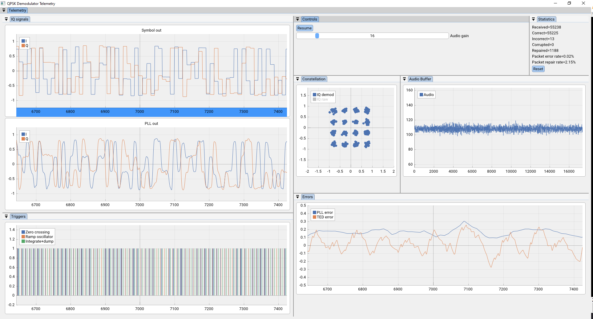

## Description
A basic and dirty 16QAM modulator which uses the 74HC86 XOR to generate the symbols.
Code for the transmitter was written for the Atmega328p in Atmel studio.
Receiver code is written for use with the RTLSDR dongle, using osmocom's rtl_sdr.exe project to get IQ values.

## Transmitter software
The encoding scheme is given as:
- 32bit preamble using multiple Barker codes
- FEC using a 1/2 rate K=3 [7,5] convolutional code
- Followed by an additive scrambler on the FEC frame

The entire frame is FEC with the convolutional code then passed through the scrambler.
Frame consists of the following:
- Payload length excluding crc8: uint16
- Payload data in bytes: uint8*
- CRC8 with polynomial 0xD5 calculated on just the payload data
- Trellis terminator sequence of 0x00

The symbol rate is 87kHz which gives 348kb/s or 43.5kB/s. 
The ADC is being sampled at 17.4kHz which produces 17.4kB/s of raw 8bit audio data.

With the encoding scheme we are transmitting audio frames at 174Hz:
1. Audio data block: 100B raw ==> 212B encoded
2. Misc data block: 13B raw ==> 38B encoded

250B at 174Hz is 43.5kB/s which matches our symbol rate.

The reason why we are polling the ADC so slowly is because the ISR used for symbol transmit can only go up to 87kHz.
This results in extreme amounts of aliasing in the sampled audio. This could be improved in the future by optimising the ISR or using a faster micro.

## Transmitter circuit
Uses the 74HC86 XOR as the modulator and a discrete current feedback amplifier for amplification and buffering.
This is a very crude transmittor which uses the 4MHz quadrature generated from the Arduino UNO's timer 1 as the carrier.

## Receiver software
We are using a very crude decision directed loop for carrier recovery and symbol timing. 
There are many improvements which could be made to this.
Software comes with a GUI made with Dear Imgui for visualisation of telemetry which includes a constellation diagram.
Audio is demodulated and played with VLC.

## Image gallery




## Compiling Implot/Imgui notes
To compile Imgui correctly with Implot you need to edit your imconfig.h.
Change the ImDrawIdx to unsigned int since ImPlot will exceed the vertex count limit without this.
```c 
#define ImDrawIdx unsigned int
```

## TODO
- Improve the demodulator by using better techniques
  - Add a CIC upsampling filter to improve the timing error detector
  - Add coarse frequency correction
- Experiment with using the STM32F401 which is much faster than the ATmega328p
- Improve software quality in general
  - Use SIMD instructions or a proper DSP library for improved performance
  - Do research on more performant implementations of software defined QAM demodulation
