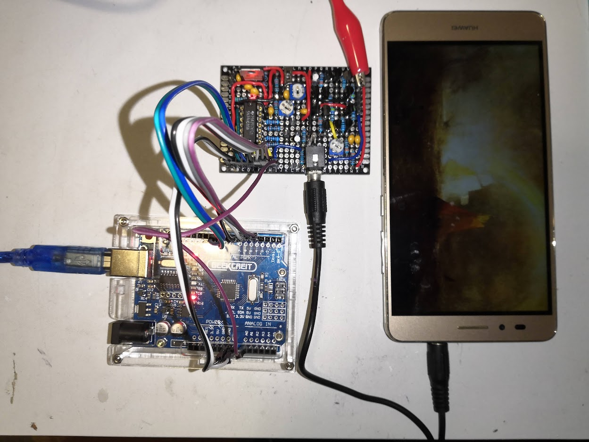

## Description
A basic and dirty 16QAM modulator which uses the 74HC86 XOR to generate the symbols.
Code for the transmitter was written for the Atmega328p in Atmel studio, and the STM32F401CCU6 using the STM32 Cube devkit.
Receiver code is written for use with the RTLSDR dongle, using osmocom's rtl_sdr.exe project to get IQ values.

## Video
[](http://youtu.be/nNVyV39n1mE "Building a 16QAM transmitter")

## Transmitter software
The encoding scheme is given as:
- 32bit preamble using multiple Barker codes
- FEC using a 1/2 rate K=3 [7,5] convolutional code
- Followed by an additive scrambler on the FEC frame

The entire frame is FEC with the convolutional code then passed through the scrambler.
Frame consists of the following:
- Payload length excluding crc8: uint16
- Payload data in bytes: uint8*
- CRC8 with polynomial 0xD5 calculated on just the payload data
- Trellis terminator sequence of 0x00

We transmit in 250B encoded blocks.

1. Audio data block: 100B raw ==> 212B encoded
2. Misc data block: 13B raw ==> 38B encoded

### Atmega328p
The symbol rate is 87kHz which gives 348kb/s or 43.5kB/s. 
The ADC is being sampled at 17.4kHz which produces 17.4kB/s of raw 8bit audio data.

With the encoding scheme we are transmitting audio frames at 174Hz:
250B at 174Hz is 43.5kB/s which matches our TX byterate.

### STM32F401
The symbol rate is 200kHz which gives 800kb/s or 100kB/s. 
The ADC is being sampled at 40kHz which produces 40kB/s of raw 8bit audio data.

With the encoding scheme we are transmitting audio frames at 400Hz:
250B at 400Hz is 100kB/s which matches our TX byterate.

## Transmitter circuit
Uses the 74HC86 XOR as the modulator and a discrete current feedback amplifier for amplification and buffering.
This is a very crude transmittor which uses the 4MHz quadrature generated from the Arduino UNO's timer 1 as the carrier.

## Receiver software
We are using a very crude decision directed loop for carrier recovery and symbol timing. 
There are many improvements which could be made to this.
Software comes with a GUI made with Dear Imgui for visualisation of telemetry which includes a constellation diagram.
Audio is demodulated and played with VLC.

## Image gallery

Circuit diagram of 16QAM transmitter.


Image of 16QAM receiver software using RTLSDR dongle.


Image of 16QAM transmitter circuit connected to Atmega328p.
This circuit can work with the STM32F401 (even with 3.3V logic out).

## Compiling Implot/Imgui notes
To compile Imgui correctly with Implot you need to edit your imconfig.h.
Change the ImDrawIdx to unsigned int since ImPlot will exceed the vertex count limit without this.
```c 
#define ImDrawIdx unsigned int
```

## TODO
- Improve the demodulator by using better techniques
  - <s>Add an upsampling block to improve the TED performance</s>
  - Add coarse frequency correction
- <s>Experiment with using the STM32F401 which is much faster than the ATmega328p</s>
- Improve software quality in general
  - Use SIMD instructions or a proper DSP library for improved performance
  - Do research on more performant implementations of software defined QAM demodulation
